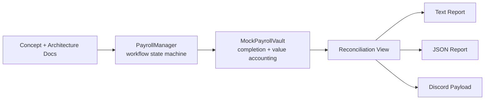

# Confidential Payroll Starter Pack for Zama


A builder-oriented starter for exploring how confidential payroll workflows can be designed on top of Zama.

This repository turns one practical real-world use case into something builders can read, run, and extend:

- architecture and concept docs for confidential payroll
- a workflow-first Solidity prototype
- a completion-aware and value-aware mock vault
- local reconciliation reporting in text, JSON, and Discord payload formats

The core idea is simple:

Payroll coordination should be able to happen onchain without exposing sensitive compensation data publicly.

## What this is

This repository is a starter pack for one concrete business-facing use case: payroll that can be coordinated onchain while keeping sensitive compensation data private.

It focuses on a simple question:

How should a confidential payroll system work if we want public execution, but private values?

## Why this repo is useful

Instead of treating confidentiality as an abstract capability, this project turns it into a workflow that builders can inspect end to end:

- batch lifecycle and role model
- record visibility and claim permissions
- funding and settlement callback behavior
- batch-level reconciliation and reporting outputs

That makes it easier to reason about where confidential applications become useful in practice, especially for payroll, bonuses, reimbursements, contractor payouts, and treasury-controlled disbursements.

## Quick start

```bash
npm install
npm test
npm run report:demo
npm run report:demo:json
npm run report:demo:discord
```

## Project status

| Area | Current status |
| --- | --- |
| Workflow model | Batch lifecycle, record visibility, claim permissions, and close rules are implemented in the prototype |
| Vault mock | Funding callbacks, settlement callbacks, completion semantics, value-accounting semantics, and reconciliation views are covered |
| Reporting | Text, JSON, and Discord webhook payload outputs are available locally |
| Validation | `75` passing local tests across contracts and reporting helpers |
| Not claimed yet | Real FHE integration, real token settlement, and production deployment guarantees are intentionally out of scope |

## How to use this in a builder workflow

One practical way to use this repository is:

1. read the docs to understand the product problem and privacy boundary
2. run the local tests to verify the workflow skeleton and guardrails
3. generate a reconciliation report to show what operational outputs look like
4. use the docs plus report outputs as builder-facing material for grant, bounty, or contributor applications
5. extend the prototype toward a real settlement layer, dashboard, or confidential-compute integration

That makes the repo useful in two directions at once:

- as a technical starter for implementation
- as a portfolio artifact that shows applied thinking around real-world confidential finance

## Architecture at a glance



## Sample output

Text report:

```text
Batch Reconciliation Report
batchId: 1
isFunded: true
isCountSettled: false
isValueSettled: false
expectedSettlementCount: 2
settlementCount: 1
remainingSettlementCount: 1
fundingAmount: 1000
settledAmount: 400
remainingFundingAmount: 600
```

JSON report:

```json
{
  "batchId": "1",
  "isFunded": true,
  "isCountSettled": false,
  "isValueSettled": false,
  "expectedSettlementCount": "2",
  "settlementCount": "1",
  "remainingSettlementCount": "1",
  "fundingAmount": "1000",
  "settledAmount": "400",
  "remainingFundingAmount": "600"
}
```

Discord webhook payload:

```json
{
  "username": "Payroll Reconciliation Bot",
  "embeds": [
    {
      "title": "Batch Reconciliation #1",
      "description": "Funded: true\nCount settled: false\nValue settled: false"
    }
  ]
}
```

## Use cases

This starter is easiest to map onto a few concrete confidential-finance patterns:

- payroll batches with private employee compensation records
- bonus and incentive distributions with visible workflow state but hidden values
- contractor and vendor payouts without exposing counterparty-level payment details
- treasury-controlled disbursements that need reconciliation without full public disclosure

## Why now

Confidential applications become easier to evaluate when builders can inspect a full workflow instead of isolated primitives.

This repository tries to make that evaluation practical by combining:

- docs that explain the business-facing problem
- a workflow-first contract skeleton
- a richer local vault stub for settlement and reconciliation semantics
- reporting outputs that can later feed dashboards, bots, or operational tooling

## Next steps

The most natural next extensions from this starter are:

- replace digest-only placeholders with real confidential-compute integrations
- connect the workflow to a real settlement layer instead of a local mock vault
- add a real Discord webhook sender or lightweight dashboard on top of reconciliation outputs
- grow the example surface into adjacent flows such as bonuses, reimbursements, and contractor settlement

## Why this matters

Traditional onchain systems are transparent by default. That works for many applications, but payroll is different.

A transparent payroll system can reveal:

- salary levels
- bonus structure
- internal team hierarchy
- contractor relationships
- treasury behavior tied to operations

This project explores how Zama can support a better model for real-world business workflows.

## Repository contents

- `docs/concept-note.md`
  High-level problem statement and project intent

- `docs/architecture.md`
  Minimum system design, actor model, privacy boundaries, and workflow structure

- `docs/tutorial-confidential-payroll.md`
  Builder-friendly walkthrough of the use case

- `examples/sample-payroll-flow.md`
  Example lifecycle of a confidential payroll batch

- `docs/prototype-plan.md`
  Explains the current prototype boundary and next implementation steps

- `contracts/PayrollTypes.sol`
  Shared enums and structs for payroll workflow modeling

- `contracts/IPayrollVault.sol`
  Future settlement-layer interface

- `contracts/MockPayrollVault.sol`
  Minimal local vault stub used to verify funding and settlement callbacks, history, rejection paths, batch-settlement completion semantics, and optional value-accounting behavior

- `contracts/PayrollManager.sol`
  Workflow-oriented prototype contract for batch lifecycle, claim tracking, and optional vault callbacks

- `test/PayrollManager.js`
  First local lifecycle tests for the payroll workflow skeleton

- `hardhat.config.cjs`
  Minimal local Hardhat configuration for compile and test

- `package.json`
  Local scripts and dev dependencies for the prototype harness

- `scripts/report-batch-reconciliation.cjs`
  Read-only helper for printing `MockPayrollVault` batch reconciliation summaries as text, JSON, or Discord webhook payload JSON

- `scripts/`
  Helper scripts and usage notes for local reporting and GitHub publish flows

## MVP goal

The MVP focuses on:

1. creating a payroll batch
2. assigning confidential employee records
3. approving the batch
4. funding the batch
5. releasing or claiming payments
6. closing the batch

## Status

Early builder contribution with a documentation-first workflow prototype.

Current local validation includes:

- Hardhat compile
- 75 passing tests across `PayrollManager`, `MockPayrollVault`, and reporting helpers
- batch details visible only to the batch employer, operator, or participating employee
- public batch summaries available without exposing the full batch struct
- public batch summaries expose workflow progress only through status, payroll period, employee count, claimed count, remaining claims, close readiness, and funding presence
- public workflow events covered for batch creation, record registration, approval, funding, claiming, and closure
- zero-address and empty-digest guardrails covered for batch creation, record registration, funding, and claiming
- missing-batch summary reads rejected with an explicit error
- record existence visibility aligned with record-viewer permissions
- employee claim permissions restricted to the record owner, employer, or operator
- repeated funding registration blocked after the first successful funding transition
- release transition blocked after the first successful release and after later states
- batch closure restricted to the employer even after all claims are settled
- claim and close state isolated across multiple concurrent batches
- funding and release permissions isolated to each batch's assigned operator or employer
- approval restricted to each batch's own employer, even across concurrent batches
- addRecord permissions isolated to each batch's own employer or operator
- claim permissions isolated to each batch's own employer, operator, or target employee
- final-state restrictions after batch closure
- mock vault callback verification for funding and settlement history
- mock vault per-batch funding and per-employee settlement state tracking
- mock vault settlement counts isolated per batch
- mock vault expected-settlement targets, remaining-settlement tracking, and settled-batch marking
- mock vault optional funding-amount, settled-amount, and remaining-funding accounting
- mock vault batch-level reconciliation reporting for settlement counts and value accounting
- local reconciliation report script with text, JSON, and Discord webhook payload output modes
- subtree publish helper for syncing the committed starter directory back to GitHub
- mock vault funding and settlement event emissions covered by local tests
- mock vault value-accounting event coverage and over-settlement rejection
- mock vault rejection of duplicate funding and duplicate settlement writes
- mock vault rejection of extra settlements after a batch is marked settled
- local reconciliation report script with demo mode and formatter/helper coverage
- vault-side rejection rollback coverage for funding and settlement registration
- payroll-layer custom errors for wrapped vault callback failures

The repository still does not claim FHE integration or production-ready settlement logic.

## Reference

- Zama Developer Program:
  https://www.zama.org/post/zama-developer-program-mainnet-season1-building-for-the-long-game
